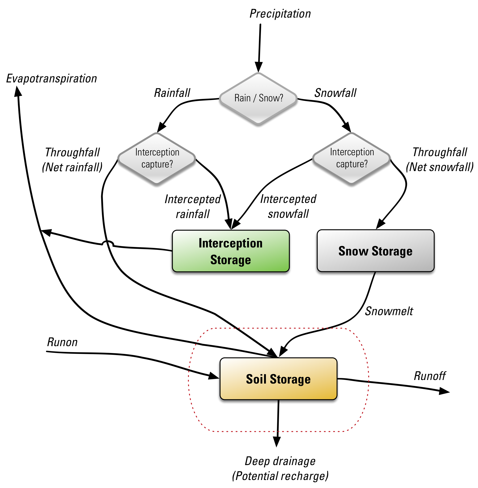

## Model Theory {#model_theory}

The SWB code uses a modified Thornthwaite-Mather soil-moisture accounting method [@thornthwaite_instructions_1957] to calculate recharge; recharge is calculated separately for each grid cell in the model domain. Sources and sinks of water within each grid cell are determined on the basis of input climate data and landscape characteristics; recharge is calculated as the difference between the change in soil moisture and these sources and sinks.

{width=5in #fig:swb_simple_conceptual}

The water balance components used to calculate potential recharge amounts are shown schematically in [@fig:swb_simple_conceptual].

The calculation proceeds as follows:

1.	Precipitation is partitioned into gross rainfall and/or gross snowfall,

2.	Intercepted rain or snow is added to the interception storage reservoir,

3.	Net snowfall is added to the snow storage reservoir,

4.	Snowmelt (if any) is calculated,

5.	Potential evapotranspiration (PET) is calculated,

6.	Interim soil moisture is calculated as $\theta_{interim}=\theta_{t-1}+rainfall+snowmelt+runoff-runon$,

7.	Interim soil moisture fraction is calculated as: $f = \frac{{\left( {{\theta _{interim}} - {\theta _{wilting\;point}}} \right)}}{{\left( {{\theta _{field\;capacity}} - {\theta _{wilting\;point}}} \right)}}$,

8.	Actual evapotranspiration (AET) is calculated as some function of $f$ and $PET$,

9.	Updated soil moisture is calculated as $\theta_t=\theta_{t-1}+rainfall+snowmelt+runon-runoff-AET$,

10.	If the updated soil moisture ($\theta_t$) exceeds the field capacity of the soil, the updated soil moisture is set to $\theta_{field\;capacity}$, making the change in soil moisture $\Delta\theta=\theta_{field\;capacity}-\theta_{t-1}$,

11.	If the updated soil moisture is less than the field capacity, potential recharge is considered to be zero,

12.	Otherwise, potential recharge is calculated as: $potential\;recharge=\theta_t-\theta_{field\;capacity}$.

In some cases it might be useful to simulate recharge in urban areas in a more detailed manner. This option is triggered in SWB 2.0 when a percent or fraction impervious area grid is supplied to the code ([@fig:swb_conceptual]). When this option is active, an additional storage reservoir is created: "impervious surface storage". In addition, it is possible to take storm drains into account by supplying the fraction of impervious surface storage that is intercepted by storm drains.

{width=5in #fig:swb_conceptual}

Implementation details regarding the storage reservoirs and process options are discussed in the next section.
