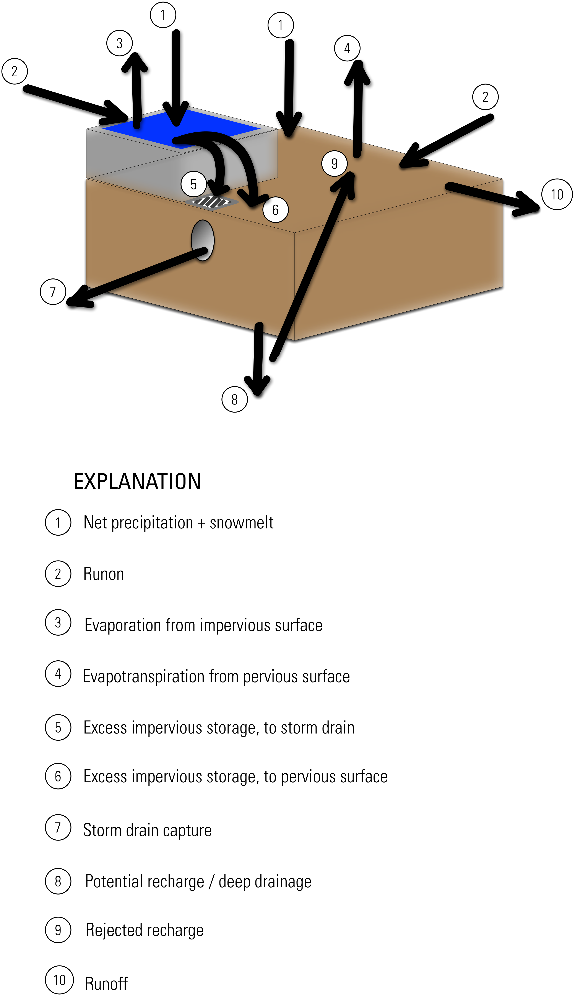

### Impervious surface runoff {#impervious_surface_runoff}

Runoff from impervious surfaces may be simulated in a more detailed manner by including a gridded dataset defining the proportion of each gridcell that is comprised of impervious materials. Data may be supplied as either a fraction (0.0-1.0) or percentage (0-100%) of either pervious or *im*pervious surface area.

Any cell that is assigned an impervious surface fraction or percent that is greater than zero will operate in a fundamentally different way than the original SWB code did; in these cells, mass balance calculations on an additional "impervious surface storage" reservoir ([@fig:impervious_schematic]).

{width=5in #fig:impervious_schematic}
