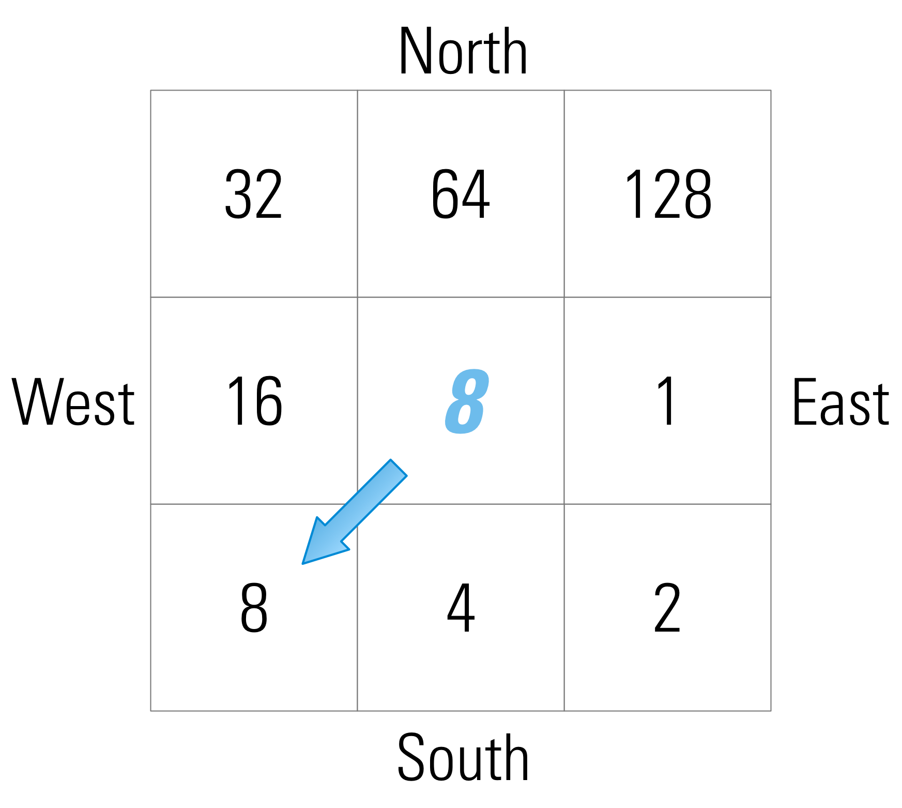

### Runoff Routing {#runoff_routing}

[TOC]

#### No Routing {#routing_none}

Downhill routing may be disabled altogether. Cell-to-cell routing becomes increasingly hard to imagine in a meaningful way as gridcell sizes exceed 1km or so; in any system with a well-developed drainage system, overland flow would almost certainly encounter some type of surface water feature over that distance. With flow routing disabled, all cell runoff is assumed to reach a surface water feature and leave the model domain.

#### Downhill Routing {#routing_downhill}

Activation of the overland flow-routing module within SWB allows runoff from one or more cells to become runon to downslope cells. All runoff from a cell is assumed to infiltrate in downslope cells or be routed out of the model domain on the same day in which it originated as rainfall or snowmelt.

During model initialization, SWB examines the connectivity between each active cell. On the basis of this connectivity, SWB creates a master list of cell IDs and sorts them from upslope to downslope. When the model solution is calculated each day, the code begins with the cell furthest upslope, performs all mass-balance calculations, and then proceeds to perform the same calculation on the next cell in the list.

Connectivity is defined on the basis of an input D8 flow-direction grid; this is a scheme by which connections between cells are encoded as an integer value within the flow-direction grid [@ocallaghan_extraction_1984]. @Fig:D8_flow_direction shows the direction encoding; the arrow shown in the figure shows a hydrologic connection from the central cell to the cell immediately to the southwest of the central cell, resulting in a flow direction value of 8. {width=2.5in #fig:D8_flow_direction}

Once water is routed to a closed surface depression and evapotranspiration and soil-moisture demands are met, the only loss mechanism is recharge. This results in cases where maximum recharge values of hundreds or thousands of inches per year are calculated. These extremely high values are unrealistic and likely result from surface storage of water not being accounted for. The code described here allows the user to enter a maximum recharge rate for each land-cover and soil-group combination. This feature offers a way to restrict the estimated recharge values to a more reasonable range; however, the rejected recharge is nonetheless removed from the model domain on the same day in which it originated as precipitation or snowmelt.
