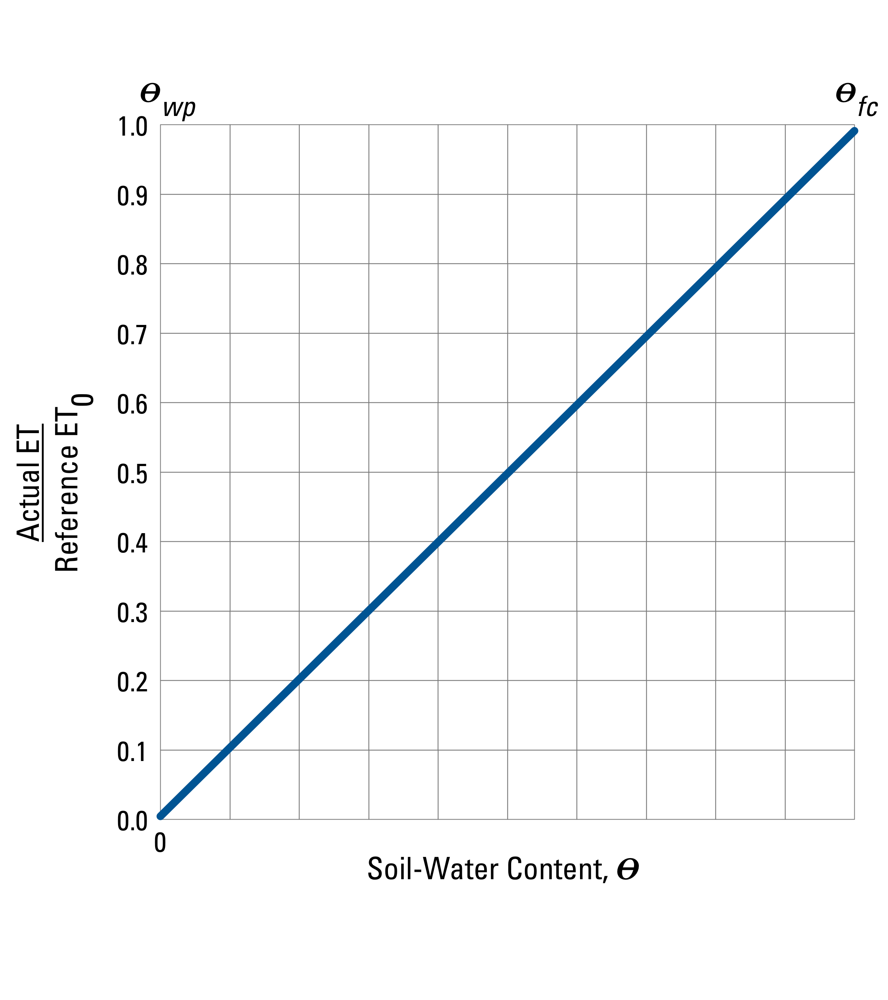
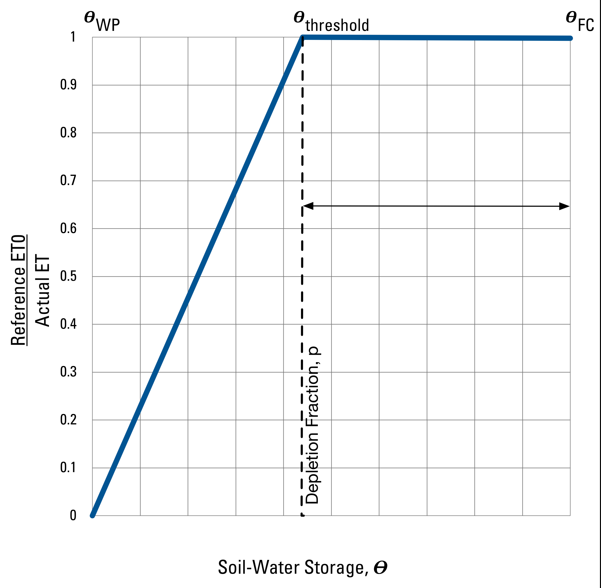

### Soil-Moisture Retention / Actual Evapotranspiration {#soil_moisture_retention}

[TOC]

#### Thornthwaite-Mather {#sm_thornthwaite_mather}

When SWB is run with this process option soil moisture is tabulated by means of the soil-water-balance methods published in Thornthwaite [-@thornthwaite_approach_1948] and Thornthwaite and Mather [-@thornthwaite_water_1955; -@thornthwaite_instructions_1957]. In order to track changes in soil moisture, several intermediary values are calculated, including precipitation minus potential evapotranspiration (P-PE), accumulated potential water loss (APWL), actual evapotranspiration, soil-moisture surplus, and soil-moisture deficit. These terms are described below.

*P minus PE* $(P-PE)$. The first step in calculating a new soil moisture value for any given grid cell is to subtract potential evapotranspiration from the daily precipitation ($P-PE$). Negative values of $P-PE$ represent a potential deficiency of water, whereas positive $P-PE$ values represent a potential surplus of water.

*Soil moisture*, $\Delta\,soil\,moisture$. The soil-moisture term represents the amount of water held in soil storage for a given grid cell. Soil moisture has an upper bound that corresponds to the soil's maximum water-holding capacity (roughly equivalent to the field capacity); soil moisture has a lower bound that corresponds to the soil's permanent wilting point.

When $P-PE$ is positive, the new soil-moisture value is found by adding this $P-PE$ term directly to the preceding soil-moisture value. If the new soil-moisture value is still below the maximum water-holding capacity, the Thornthwaite-Mather soil-moisture tables are consulted to back-calculate a new, reduced accumulated potential water-loss value. If the new soil-moisture value exceeds the maximum water-holding capacity, the soil-moisture value is capped at the value of the maximum water-holding capacity, the excess moisture is converted to recharge, and the accumulated potential water-loss term is reset to zero.

When $P-PE$ is negative, the new soil-moisture term is found by looking up the soil-moisture value associated with the current accumulated potential water-loss value in the Thornthwaite-Mather tables.

*Actual ET*. When $P-PE$ is positive, the actual evapotranspiration equals the potential evapotranspiration. When $P-PE$ is negative, the actual evapotranspiration is equal only to the amount of water that can be extracted from the soil ($\Delta$ soil moisture).

##### Calculation Procedure

During the course of a model run, the soil layer is considered to be in one of three states:

| $P - PE$    | Soil Status                                     |     $SM_{t}$       | $APWL_{t}$  |  $AET_{t}$   |  Excess (potential recharge) |
|-------------|-------------------------------------------------|--------------------|-------------|----------|---------------------|
|  < 0        | drying                                          | SM from T-M tables | $APWL_{t-1} + (P-PE)$ | $SM_{t-1} - SM_{t}$  | 0.0     |
|  > 0        | wetting *and* $SM_{t-1} + (P - PE) < SM_{max}$  | $SM_{t-1} + (P-PE)$| $APWL$ from tables   | $PE$ |   0.0         |
|  > 0        | wetting *and* $SM_{t-1} + (P - PE) > SM_{max}$  | $SM_{max}$  | 0.0  | $PE$   | $SM_{t-1} + (P - PE) - SM_{max}$    |

Table: Soil moisture states. {#tbl:sm_states}

##### Relation between Accumulated Potential Water Loss and Extractable Water

Version 1.0 of the SWB model reads in digitized versions of the Thornthwaite-Mather soil-moisture retention tables. The amount of computing involved in negotiating the lookup tables and interpolating a result was significant enough to warrant generalization; in addition, small roundoff errors were accumulated in the course of repeated conversions between accumulated potential water loss and the corresponding soil moisture values. In order to avoid the use of lookup tables altogether a generalized equation was developed, using the Thornthwaite and Mather [-@thornthwaite_instructions_1957] table values as the basis for the equations.

There are at least two articles in the literature that describe simple relations that can be used to summarize the Thornthwaite-Mather table values. They are essentially the same, varying only in the choice to use the base-10 or natural logarithm in the calculation.

The first form of the generalized equation is suggested by Pastor and Post [-@pastor_calculating_1984]:

$soil\,moisture = SWC \cdot {e^{\left( {constant - {\textstyle{{factor} \over {SWC}}}} \right)APWL}}$

where:

   $SWC$ is the soil water capacity (or field capacity), and
   $APWL$ is the accumulated potential water loss.

Pastor and Post [-@pastor_calculating_1984] report values of 0.000461 for the value of the constant, and 1.10559 for the factor value.

The second form of the generalized equation is suggested in Kolka and Wolf [-@kolka_estimating_1998]:

$soil\,moisture = {10^{\left[ {{{\log }_{10}}(SWC) - \left( {{\textstyle{{constant} \over {SWC^{exponent}}}}} \right)APWL} \right]}}$

where:
  $SWC$ is the soil water capacity (or field capacity), and
  $APWL$ is the accumulated potential water loss.

Kolka and Wolf [-@kolka_estimating_1998] report values of 0.525 for the value of the constant, and 1.0371 for the value of the exponent.

##### Thornthwaite-Mather without calculating Accumulated Potential Water Loss

Calculating the amount of soil moisture that can be extracted for a given accumulated potential water loss (APWL) is made easier by adopting a simple equation-based approach as discussed in the previous section. However, this approach still requires that the APWL be calculated and stored for each grid cell. It turns out that there is a better way.

The relation that Thornthwaite and Mather tabulated in their reports and others later represented by fitted equations is depicted graphically in the figure below.

~~~~~~~~
CONTROL_FILE_STATEMENT 1
CONTROL_FILE_STATEMENT_2
~~~~~~~~

Etiam rhoncus. Maecenas tempus, tellus eget condimentum rhoncus, sem quam semper libero, sit amet adipiscing sem neque sed ipsum. Nam quam nunc, blandit vel, luctus pulvinar, hendrerit id, lorem. Maecenas nec odio et ante tincidunt tempus.

#### FAO-56 {#sm_fao_56}

Lorem ipsum dolor sit amet, consectetuer adipiscing elit. Aenean commodo ligula eget dolor. Aenean massa. Cum sociis natoque penatibus et magnis dis parturient montes, nascetur ridiculus mus. Donec quam felis, ultricies nec, pellentesque eu, pretium quis, sem. Nulla consequat massa quis enim. Donec pede justo, fringilla vel, aliquet nec, vulputate eget, arcu. In enim justo, rhoncus ut, imperdiet a, venenatis vitae, justo. Nullam dictum felis eu pede mollis pretium.

Etiam rhoncus. Maecenas tempus, tellus eget condimentum rhoncus, sem quam semper libero, sit amet adipiscing sem neque sed ipsum. Nam quam nunc, blandit vel, luctus pulvinar, hendrerit id, lorem. Maecenas nec odio et ante tincidunt tempus.

#### Zahner {#sm_zahner}
