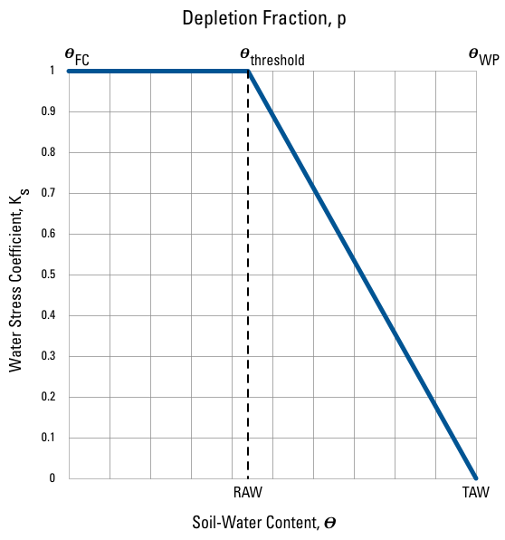

### Crop Coefficients {#crop_coefficients}

When the irrigation demand is simulated in SWB, the underlying soil-moisture module is automatically changed to the FAO-56
The calculation under 'nonstandard' conditions includes the transpiration-limiting effects of soil water stress on plants. When this option is invoked in swb, the Thornthwaite-Mather soil moisture retention tables are **not** consulted. Rather, the crop evapotranspiration amount $(E{T_{c,adj}})$ is adjusted by incorporation of a water stress factor $({K_s})$ whose value may range between 0.0 and 1.0:

$$E{T_{c,adj}} = {K_s}{K_c}E{T_{o}}$$

${K_s}$ is defined by the doil moisture deficit relative to two soil moisture amounts: the Readily Available Water (RAW) and Total Available Water (TAW) amounts. At soil moisture deficits less than the RAW amount, it is assumed that plants have adequate available moisture for growth; plants are assumed to be under no water stress. The value of ${K_s}$ is one under these conditions.

Once soil moisture deficit increases beyond the RAW amount, ${K_s}$ decreases linearly, reaching a value of zero as the soil moisture deficit approaches the TAW value.

Total Available Water $(TAW)$ is defined as the **maximum** amount of water that can be present within the root zone, and is calculated in swb as:

$$TAW = AWC \cdot (rooting\;depth)$$

where

$AWC$ is the Available Water Capacity, in inches per foot, and   
$root\;depth$ is the current rooting depth of vegetation in feet.

Readily Available Water $(RAW)$ is defined as the amount of water that can be withdrawn by a plant from soil moisture storage without the plant suffering water stress. $RAW$ may be defined as some fraction of the Total Available Water:

$$RAW = p \cdot TAW$$

where

$p$ is the fraction of Total Available Water $TAW$ that can be removed from soil moisture storage before a plant begins suffering from water stress.

$p$ is called the "plant stress depletion fraction" in the swb irrigation lookup table.

The figure below, taken from FAO-56 [@allen_crop_1998], shows how the water stress factor changes with changing soil moisture deficit amounts.

{#fig:depletion_frac}

As shown in +@fig:depletion_frac, the depletion parameter defines the soil moisture conditions below which the actual to potential ET ratio drops toward zero.
