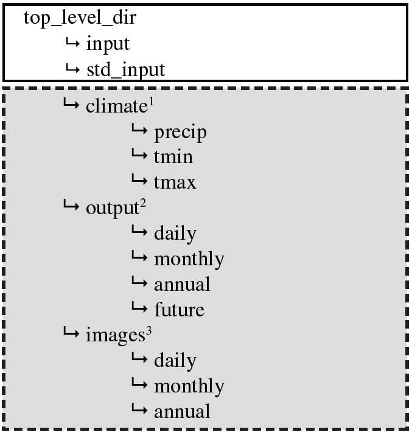

## Directory Structure {#directory_structure}

In earlier versions of SWB 1.0, a number of "hard-coded" assumptions were made about where the files needed by SWB would be found. [@Fig:suggested_dir_structure] shows what the suggested directory structure looks like.

{#fig:suggested_dir_structure}

Current versions of SWB 1.0 still point to the directory structure outlined above, but a set of control file directives may be used to change the output and image file locations to anything the user desires:

    OUTPUT_PATH
    OUTPUT_DAILY_PATH
    OUTPUT_MONTHLY_PATH
    OUTPUT_ANNUAL_PATH
    OUTPUT_FUTURE_PATH

    IMAGE_PATH
    IMAGE_DAILY_PATH
    IMAGE_MONTHLY_PATH
    IMAGE_ANNUAL_PATH

If these values are left empty (blank) within the control file, SWB will place the output and images in the same directory as was active when the code was started. This can be useful when running a SWB model with PEST, for example. The pathnames may be relative or absolute (for example, relative: '../model1/output', or absolute: 'd:/Data/models/model1/output').
