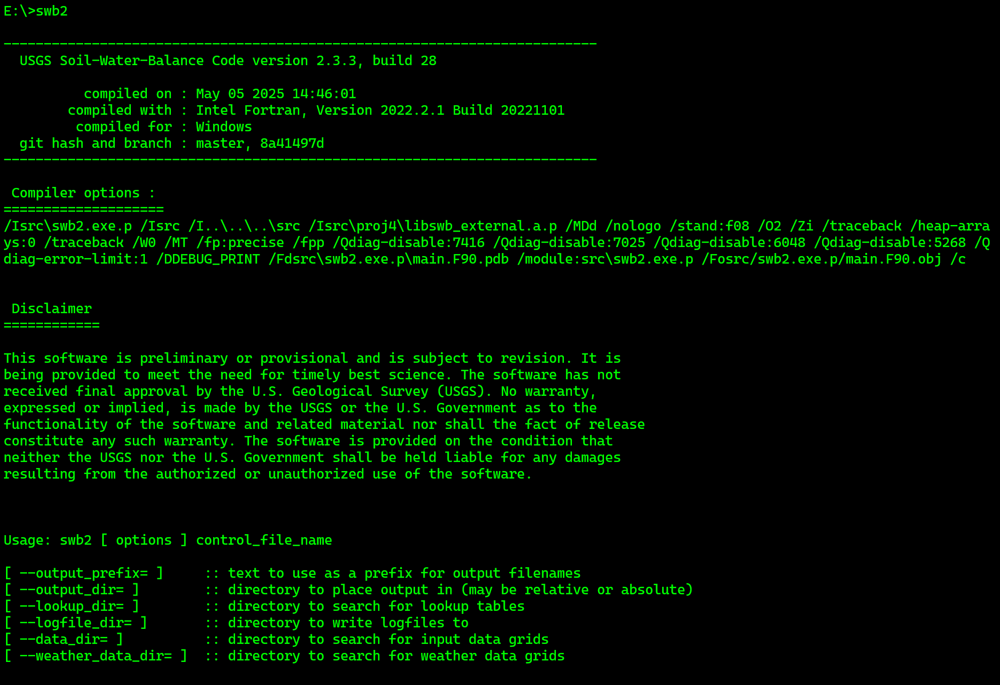
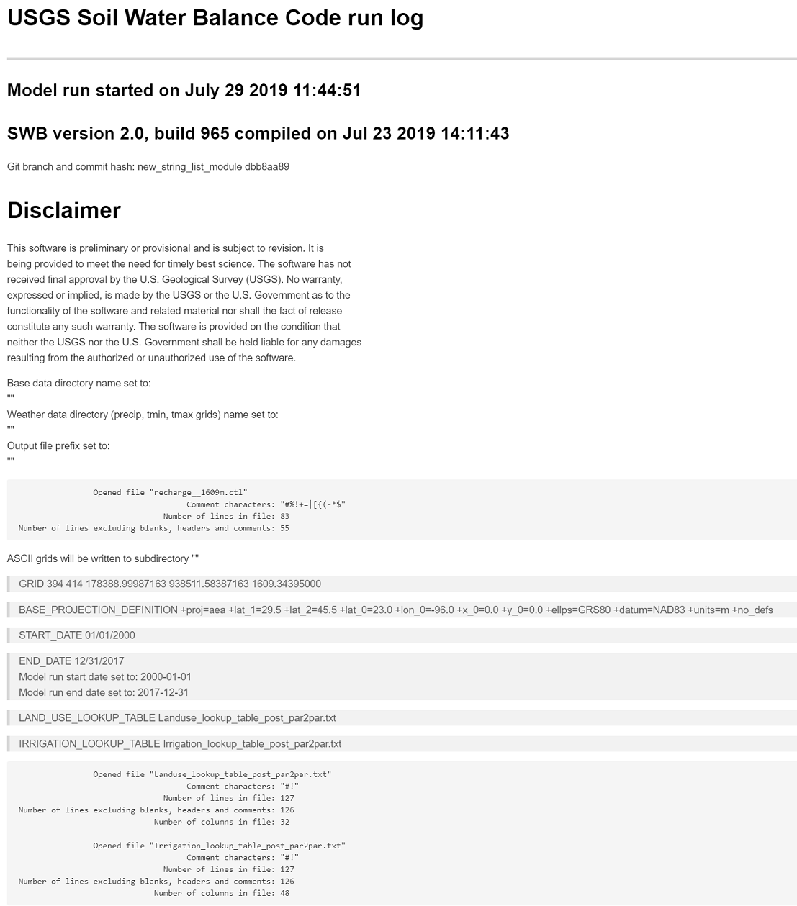

# Online Documentation

**DRAFT!! WORK IN PROGRESS**

The official documentation for this code is contained in [USGS Techniques and Methods Report 6-A59](https://pubs.er.usgs.gov/publication/tm6A59). This online documentation is a work-in-progress. While we will try to keep this as up-to-date as possible, you may find occasionally find instances where the actual behavior of the code differs from the official documentation or from this online documentation. Please consider submitting an issue on the [GitHub repository](https://github.com/smwesten-usgs/swb2/issues) if you find such differences between code and documentation.

## Installing and Running Soil-Water-Balance Version 2.0

SWB is compiled Fortran 2008 code; no installation is needed other than copying the executable program to the desired location on the system hard drive. When the name of the executable is typed at a terminal command prompt, SWB will start up, list the compilation date, list the Git commit hash and branch, and finally, list any options that may be invoked (fig 1). Git is a software tool designed to keep track of changes made to a source code such as SWB (Torvalds and Hamano, 2010). A Git commit hash is a symbol that uniquely identifies the state of the code modules used to compile the version of SWB the user is running. If a SWB run has issues, the Git commit hash is crucial for recreating the code as it existed during compilation. 



**Figure 1.**  Command-line response when Soil-Water-Balance (SWB) version 2.0 is
    executed with no other arguments.

### System Requirements

SWB compiles and runs on any modern hardware including Apple Macintosh, Linux, or Windows-based systems. Performance will generally be better on a system with greater processing speed and more random access memory (RAM). A small problem, consisting of a model domain of about 100 cells by 100 cells, will run on a small single-board computer such as a Raspberry Pi, albeit slowly.

SWB is able to access large gridded daily weather datasets by use of the netCDF library and will run efficiently by pulling out only the data needed for the simulation. It is possible to supply SWB with gridded weather data such as Daymet (Thornton and others, 2016) for the conterminous United States even if the model application area is only a few square kilometers; SWB will pull the local values as needed. However, a year of Daymet data covering the continental United States takes up almost 3 gigabytes (GB) of disk space; a simulation spanning from 1980 to 2018 would require more than 100 GB of disk storage for just the daily weather dataset. The authors have had success using Python packages such as xarray to effciently pare down continental-scale daily weather input netCDF files to a size covering local or regional SWB application areas.

Output from SWB is in the form of a compressed Network Common Data Form (netCDF) file (Unidata, 2014). A 346 by 400-cell example problem run with SWB for a 2-year period generates about 900 megabytes (MB) of file output. For a typical SWB simulation, a hard drive with empty space ranging from 100 GB or greater is recommended to accommodate the output files generated by SWB.

### Running SWB

SWB must be run from an operating system command line, with a control filename specified. If the command 'swb2' is entered at the command prompt without providing a control filename, SWB will print out some diagnostic information (fig 1.). The information includes the date of compilation and a Git hash that uniquely identifies the source code used in the compilation SWB also prints out a message that mentions three command-line options: --output_prefix, --output_dir, and --data_dir.

Within the control file, paths may be specified so that the input datasets may stay in their own dedicated space on the hard drive. SWB will use relative or absolute paths to files. The --output_prefix option allows the user to specify a text string that will be affixed to the front of each output file name. The --output_dir option allows the user to specify the location in which program output should be stored. The --data_dir option may be used to specify the location on the disk that SWB will search for input data.

If swb2 my_control_file.ctl --output_prefix=WI_ --output_dir=output --data_dir=input is entered at the command line, an SWB run will begin with whatever options are contained within the control file. Output files will be prefixed with the characters WI_ and saved in the output subdirectory, and the required data will be accessed in the input subdirectory.

## Overview of Input and Output Files

SWB requires a combination of gridded and tabular files as input and produces several gridded netCDF files and logfiles as output. This section discusses the input files required by and output files generated by SWB.
### Input Files

Several different input files must be in place for an SWB simulation to work. The most important of these files is the SWB control file. The control file specifies the location of input data grids and climate datasets and is the place where the user may select specific program options. A lookup table, or possibly several lookup tables, are required to relate SWB model parameters to the land use or hydrologic soil group, or both. Input-data grids are used to provide SWB with a map of land-use and soil-related information. Finally, daily weather data must be provided in either tabular or gridded form. These input files are discussed in greater detail in the following sections.
### Control File
The SWB control file contains all details about the grid specifications, gridded and tabular datasets to be used, and the location and name of lookup tables. SWB does not require the control file entries to be made in any particular order. The control file statements do not need to be in uppercase letters; `Lookup_table` works as well as `LOOKUP_TABLE`. Note that in SWB version 2.0, the cartographic projection of the SWB project grid is required to be supplied by means of the `BASE_PROJECTION_DEFINITION` directive in the form of a PROJ string (fig. 2).
```
## SWB 2 will ignore lines that begin with one of the following:  #%!+=
## also, SWB doesn't care about blank lines
## the order of lines makes no difference to SWB; however, it is useful for
## users to see the definition of the underlying grid up front

! Define model domain extent, origin coordinates, and resolution
!-----------------------------------------------------------------------------
!       nx    ny          xll            yll      resolution
!----------+-----+------------+--------------+---------------
GRID   400   346       545300.       432200.             90.

! where:      nx, ny          are the number of columns and number of rows
!             xll, yll        are the coordinates for the lower left-hand corner of the *grid*
!             res             is the grid cell resolution

% SWB grid projection *must* be defined in SWB 2.0
% projection in this example is Wisconsin Transverse Mercator(!)
BASE_PROJECTION_DEFINITION +proj=tmerc +lat_0=0.0 +lon_0=-90.0 +k=0.9996 +x_0=520000 +y_0=-4480000 +datum=NAD83 +units=m

% Select which methods SWB should use
%-----------------------------------------------------------------------------
INTERCEPTION_METHOD             BUCKET
EVAPOTRANSPIRATION_METHOD       HARGREAVES
RUNOFF_METHOD                   CURVE_NUMBER
SOIL_MOISTURE_METHOD            FAO-56_TWO_STAGE
FOG_METHOD                      NONE
FLOW_ROUTING_METHOD             NONE
IRRIGATION_METHOD               FAO-56
ROOTING_DEPTH_METHOD            DYNAMIC
CROP_COEFFICIENT_METHOD         FAO-56
DIRECT_RECHARGE_METHOD          NONE
SOIL_STORAGE_MAX_METHOD         CALCULATED
AVAILABLE_WATER_CONTENT_METHOD  GRIDDED

% Define input weather data grids
%-----------------------------------------------------------------------------
! precipitation: converting mm to inches
PRECIPITATION NETCDF ../Daymet_V3_2016/daymet_v3_prcp_%y_na.nc4
PRECIPITATION_GRID_PROJECTION_DEFINITION +proj=lcc +lat_1=25.0 +lat_2=60.0 +lat_0=42.5 +lon_0=-100.0 +x_0=0.0 +y_0=0.0 +ellps=GRS80 +datum=NAD83 +units=m +no_defs
PRECIPITATION_NETCDF_Z_VAR   prcp
PRECIPITATION_SCALE_FACTOR    0.03937008

! maximum air temperature: converting degrees Celsius to degrees Fahrenheit
TMAX NETCDF ../Daymet_V3_2016/daymet_v3_tmax_%y_na.nc4
TMAX_GRID_PROJECTION_DEFINITION +proj=lcc +lat_1=25.0 +lat_2=60.0 +lat_0=42.5 +lon_0=-100.0 +x_0=0.0 +y_0=0.0 +ellps=GRS80 +datum=NAD83 +units=m +no_defs
TMAX_SCALE_FACTOR    1.8
TMAX_ADD_OFFSET     32.0

! minimum air temperature: converting degrees Celsius to degrees Fahrenheit
TMIN NETCDF ../Daymet_V3_2016/daymet_v3_tmin_%y_na.nc4
TMIN_GRID_PROJECTION_DEFINITION +proj=lcc +lat_1=25.0 +lat_2=60.0 +lat_0=42.5 +lon_0=-100.0 +x_0=0.0 +y_0=0.0 +ellps=GRS80 +datum=NAD83 +units=m +no_defs
TMIN_SCALE_FACTOR                 1.8
TMIN_ADD_OFFSET                  32.0
TMIN_MISSING_VALUES_CODE     -9999.0
TMIN_MISSING_VALUES_OPERATOR   \<=
TMIN_MISSING_VALUES_ACTION     mean

% Continuous Forzen Ground Index initial value and upper and lower limits
%-----------------------------------------------------------------------------
INITIAL_CONTINUOUS_FROZEN_GROUND_INDEX CONSTANT 100.0
UPPER_LIMIT_CFGI 83.
LOWER_LIMIT_CFGI 55.

% Define flow direction, hydrologic soils group, land-use, available
% water-content grids
%-----------------------------------------------------------------------------
FLOW_DIRECTION ARC_GRID ../swb/input/d8_flow_direction.asc
FLOW_DIRECTION_PROJECTION_DEFINITION +proj=tmerc +lat_0=0.0 +lon_0=-90.0 +k=0.9996 +x_0=520000 +y_0=-4480000 +datum=NAD83 +units=m

HYDROLOGIC_SOILS_GROUP ARC_GRID ../swb/input/hydrologic_soils_group.asc
HYDROLOGIC_SOILS_GROUP_PROJECTION_DEFINITION +proj=tmerc +lat_0=0.0 +lon_0=-90.0 +k=0.9996 +x_0=520000 +y_0=-4480000 +datum=NAD83 +units=m

LANDUSE ARC_GRID ../swb/input/landuse.asc
LANDUSE_PROJECTION_DEFINITION +proj=tmerc +lat_0=0.0 +lon_0=-90.0 +k=0.9996 +x_0=520000 +y_0=-4480000 +datum=NAD83 +units=m

AVAILABLE_WATER_CONTENT ARC_GRID ../swb/input/available_water_capacity.asc
AVAILABLE_WATER_CONTENT_PROJECTION_DEFINITION +proj=tmerc +lat_0=0.0 +lon_0=-90.0 +k=0.9996 +x_0=520000 +y_0=-4480000 +datum=NAD83 +units=m

% Specify lookup tables; this is where most model parameters are defined
%-----------------------------------------------------------------------------

% SWB 2.0 can accommodate multiple lookup tables; however, column names
% may not be repeated from one table to another. Thus, if the land-use code column
% heading in the land use lookup table has the name LU_CODE, the irrigation lookup
% table heading could be called LU_CODE2

LANDUSE_LOOKUP_TABLE std_input/landuse_table_SWB2.txt
IRRIGATION_LOOKUP_TABLE std_input/irrigation_table_SWB2.txt

% Irrigation mask file can be used to definitively activate or inactivate
% simulation of irrigation inputs on a cell-by-cell basis
%-----------------------------------------------------------------------------
IRRIGATION_MASK ARC_GRID ../swb/input/irrigation_mask_from_cdl.asc
IRRIGATION_MASK_PROJECTION_DEFINITION +proj=tmerc +lat_0=0.0 +lon_0=-90.0 +k=0.9996 +x_0=520000 +y_0=-4480000 +datum=NAD83 +units=m


% Specify some initial conditions
%-----------------------------------------------------------------------------
INITIAL_PERCENT_SOIL_MOISTURE CONSTANT 100.0
% initial snow storage as liquid water; at a rough 10:1 ratio of
% snow to liquid water, 10 inches of snow would be roughly 1.0 inches of
% liquid water
INITIAL_SNOW_COVER_STORAGE CONSTANT      1.0

% this option is good for debugging, but might be useful when one wants a lot of
% detail about what SWB is doing

DUMP_VARIABLES COORDINATES 563406. 454630.
DUMP_VARIABLES COORDINATES 552982. 439512.

% for SWB 2.0, the start and end dates need not follow calendar year bounds;
% the run may start and end on any arbitrary day.

START_DATE 01/01/2013
END_DATE 12/31/2014
```

**Figure 2.** Annotated SWB2 control file.

The section of the SWB control file in figure 2 shows how the `SCALE_FACTOR` and `ADD_OFFSET` suffixes can be used to ensure that gridded data in the International System of Units (millimeter, degrees Celsius) are converted to U.S. customary units (inch, degrees Fahrenheit) as the grids are read in by SWB. Toward the end of the control file syntax shown in figure 2 are several directives that need additional explanation. The `INITIAL_PERCENT_SOIL_MOISTURE` directive allows the user to set the percent of soil saturation for each grid cell in the model. Likewise, the `INITIAL_SNOW_COVER_STORAGE` directive allows the user to set the amount of snow as water equivalent for each grid cell in the model. Both of these directives may be specified as `CONSTANT` values or may be specified as `Arc_Grid` or `Surfer` grids. If gridded values are supplied, the grids must be in the same cartographic projection and of the same dimensions as the SWB project grid *or a projection must be supplied for the grid*. 

The choice regarding the use of a constant value instead of a gridded set of initial conditions for these values is project-specific. If the first year of a simulation is to be discarded as a spool-up period (a period in which soil-moisture and snow-depth values lose the memory of their initial condition values), then reasonable values suitable for average project area conditions may be specified as `CONSTANT` values. For a project in the northern Midwest of the United States, the `INITIAL_PERCENT_SOIL_MOISTURE` might be set to 70 percent, and the `INITIAL_SNOW_COVER_STORAGE` might be set to 1.0 inches. Alternatively, SWB could be run for several years with the last day of the simulation ending just before the start date of the period of interest. The soil-moisture and snow-storage values on the last day of such a simulation could be extracted and supplied as initial conditions to SWB for the run covering the time period of interest.
### Lookup Tables

In addition to the gridded data, one or more lookup tables must be provided to supply parameter values to the SWB methods. Many parameters are specified for specific combinations of land-use categories and hydrologic soil groups. At a minimum, a SWB application requires the user to supply parameter values for the Soil Conservation Service curve number, the maximum recharge rate, the growing and nongrowing season interception values, and the rooting depths; except for the interception values, these parameters are specified for each combination of land use category and hydrologic soil group.

SWB version 2.0 uses keywords to identify parameter values within the table; the new lookup tables allow parameters to be supplied in any arbitrary column order. A separate column of parameter values must be supplied for each soil type. A snippet of the new table format is listed in table 2-1). Of the field values listed, the land-use code (LU_Code) is the key that relates the table values back to the land-use grid. The "Description" field is ignored by SWB, and the remaining fields specify the maximum surface storage for a given land use and the range of curve numbers for combinations of land-use categories and hydrologic soil groups. Tables could be easily prepared using spreadsheet software such as Microsoft Excel; however, tables should be saved as a tab-delimited text file for use with SWB.

**Table 1.**  Extract from the Soil-Water-Balance (SWB) version 2.0 table format.
[CN, curve number; LU, landuse]

| LU_code | Description                | Surface_storage_max | CN_1 | CN_2 | CN_3 | CN_4 |
| -------- | -------------------------- | --------------------- | ----- | ----- | ----- | ----- |
| 0        | Background                 | 0                     | 100   | 100   | 100   | 100   |
| 2        | Pineapple                  | 0                     | 42    | 64    | 76    | 81    |
| 3        | Coffee                     | 0                     | 52    | 70    | 80    | 84    |
| 4        | Diversified agriculture    | 0                     | 55    | 72    | 82    | 85    |
| 5        | Macadamia                  | 0                     | 44    | 65    | 77    | 82    |
| 6        | Fallow_grassland          | 0                     | 37    | 61    | 74    | 79    |
| 7        | Developed open space       | 0                     | 37    | 61    | 74    | 79    |
| 8        | Developed low intensity    | 0                     | 60    | 75    | 84    | 87    |
| 9        | Developed medium intensity | 0.25                  | 70    | 82    | 88    | 91    |
| 10       | Developed high intensity   | 0.25                  | 81    | 88    | 92    | 94    |

In SWB 2.0, each column should be clearly identified so that the proper parameters may be linked to their respective process methods. Parameters that are tied to land use and to soil type are identified in the header in the form `parameter_name_#`, where `#` is the index value of the hydrologic soil group and must correspond to the values given in that grid. There must be a column for each index value found in the grid file. 

Soil types (hydrologic soil groups) are assumed to be numbered from 1 to *n*, where *n* is the number of different soil groupings. If a soil with five distinct hydrologic soil groups is supplied, the lookup table would need curve numbers for each land use and soil type combination; the column names for these curve numbers would be CN_1, CN_2, CN_3, CN_4, and CN_5. If multiple lookup tables are used, the row ordering must be consistent from one table to the next; SWB will perform some basic sanity checks on the table values, but will assume that values from all tables are defined relative to the order of land-use codes read from the first table that the SWB checks.

### Input Data Grids

Several input data grids are required to perform a basic SWB run. As a SWB model, basic information about the soils is required. The typically required data grids are discussed in the following sections. Choosing other optional process methods may negate the need for the grids discussed in this section; however, additional gridded data types may be required.

#### Hydrologic Soil Group

The hydrologic soil group grid is an integer-valued grid that contains the soil group for each cell in the model. Any number of soils may be used in this grid, but frequently SWB models use the integers 1, 2, 3, and 4 to represent the 4 standard hydrologic soil groups defined as part of the curve number literature. The U.S. Department of Agriculture, Natural Resources Conservation Service, formerly the Soil Conservation Service, has categorized more than 14,000 soil series within the United States into 1 of 4 hydrologic soil groups (A-D) on the basis of infiltration capacity. Hydrologic soil group information may be input to the model as an Arc ASCII or Surfer integer grid with values ranging from 1 (soil group A) to 4 (soil group D). Soils in hydrologic soil group A have a high infiltration capacity and, consequently, a low overland flow potential. In contrast, soils in hydrologic soil group D, have a low infiltration capacity and, consequently, a high overland flow potential (table 2).

**Table 2.**  Infiltration rates for hydrologic soil groups and associated Soil-Water-Balance (SWB) grid values.

| Hydrologic soil group | Infiltration rate              | Integer grid value |
| --------------------- | ------------------------------ | ------------------ |
| A                     | Greater than 0.3 inch per hour | 1                  |
| B                     | 0.15-0.3 inch per hour         | 2                  |
| C                     | 0.05-0.15 inch per hour        | 3                  |
| D                     | Less than 0.05 inch per hour   | 4                  |

#### Available Water Capacity

SWB needs one or more datasets for use in assigning the size of the soil-storage reservoirs. The user can specify gridded datasets of either (1) maximum soil-water capacity in inches, or (2) available-water-capacity in inches per foot, along with tabular values of the rooting depth in feet. Traditionally SWB uses the gridded available water capacity and tabular rooting depth to calculate a maximum soil water-holding capacity for each grid cell. The maximum soil-water capacity is calculated as in equation 1.
(1)

If the maximum soil-water capacity is not specified directly, each grid cell within the model area must be assigned an available water capacity and each combination of land use and soil type assigned a rooting depth in the lookup table. Soil classifications, which include an estimate of the available water capacity or textural information, are typically available through the state offices of the Natural Resources Conservation Service or on the [NRCS website](https:\\soils.usda.gov). If data for available water capacity are not available, the user can use soil texture to assign a value, listed in table 2-3 (original source table 10, Thornthwaite and Mather, 1957).

**Table 3.**  Estimated available water capacities for various soil-texture groups.

| Soil texture         | Available water capacity (inches per foot of thickness) |
| -------------------- | ------------------------------------------------------- |
| Sand                 | 1.20                                                    |
| Loamy sand           | 1.40                                                    |
| Sandy loam           | 1.60                                                    |
| Fine sandy loam      | 1.80                                                    |
| Very fine sandy loam | 2.00                                                    |
| Loam                 | 2.20                                                    |
| Silt loam            | 2.4                                                     |
| Silt                 | 2.55                                                    |
| Sandy clay loam      | 2.70                                                    |
| Silty clay loam      | 2.85                                                    |
| Clay loam            | 3.00                                                    |
| Sandy clay           | 3.20                                                    |
| Silty clay           | 3.40                                                    |
| Clay                 | 3.60                                                    |

The available water capacity of a soil is typically given as inches of
water-holding capacity per foot of soil thickness. For example, if a
soil type has an available water capacity of 2 inches per foot and the
root-zone depth of the cell under consideration is 2.5 feet, the maximum
water capacity of that grid cell would be 5.0 inches. The 5.0 inches is
the maximum amount of soil-water storage that can take place in the grid
cell. Water added to the soil column in excess of this value will become
recharge.

A grid containing the maximum soil-water capacity may be input directly
into the SWB code, bypassing the internal calculation of the maximum
soil-water capacity.

#### Land-Use Code

The model uses land-use information, together with the soil-available,
water-capacity information, to calculate surface runoff and assign a
maximum soil-moisture holding capacity for each grid cell. The original
model required that land-use classifications follow a modified Anderson
Level II Land Cover Classification (Anderson and others, 1976). SWB can
handle any arbitrary land-use classification method as long as the
accompanying land-use lookup table contains curve-number, interception,
maximum-recharge, and rooting-depth data for each land-use type
contained in the grid. Data from the Multi-Resolution Land
Characteristics Consortium (<https://www.mrlc.gov/>) are a common source
for land-use data, but any suitable gridded dataset may be used.

#### D8 Surface-Water-Flow Direction

The SWB code requires an integer flow-direction grid for the entire
model domain when the flow-routing method is enabled. SWB uses the
flow-direction grid to determine how to route overland flow between
cells. The user must create the flow-direction grid consistent with the
D8 flow-routing algorithm (O'Callaghan and Mark, 1984), with flow
directions defined as shown in figure 2-5*B*. The original algorithm
assigns a unique flow direction to each grid cell by determining the
steepest slope between the central cell and its eight neighboring cells.
For the cells shown in figure 2-5*A*, the steepest descent algorithm
results in flow from the central cell to the southwest; the
corresponding cell figure 2-5*B*, located to the southwest of the
central cell, contains the number 8. By convention, therefore, the D8
flow direction for the cell shown in figure 2-5*A* is 8.

5.  Example (a) elevation grid values, in meters, and (b) resulting D8
    flow-direction encoding.

Many GIS software implementations of the D8 algorithm generate
intermediate grids whereby neighboring cells are assigned a combination
of flow-direction encodings. A cell for which all neighboring cells are
of equal or greater elevation is a cell that Jenson and Domingue (1988)
called a condition 4 cell. For example, if the cells to the east,
southeast, south, and southwest of the central cell in figure 2-5*A* all
share the same elevation as the central cell (109), water might be
expected to flow to any one of the neighboring cells. The flow direction
for such a cell might be encoded as; a flow direction that is not a
power of 2 is most likely to be generated from an unfilled digital
elevation model. SWB is not equipped to handle these values.

In the SWB code, a cell for which the flow-direction value is not a
power of 2 (as shown in fig. 2-5*B*) is considered to indicate a closed
depression. The SWB code does not attempt to split flows between two or
more cells; if a cell has more than one possible flow direction, the
cell is identified as a closed depression. The SWB code allows no
further surface runoff to be generated or ponding to occur. The SWB
code, instead, requires water in excess of the soil-moisture capacity to
contribute to net infiltration, with net infiltration in excess of any
maximum net-infiltration rate extracted from the model domain and
tracked as runoff_outside.

For best results, the user must carefully consider whether the D8
flow-direction grid should be generated from an unfilled or a filled
digital elevation model and if SWB's treatment of flow-direction grid
values that are not a power of 2 (as a depression) is acceptable. In
addition, some researchers suggest that the traditional filling
procedure used to prepare grids for use in determining D8 flow direction
may be inappropriate for glaciated areas of the country where large
areas of internal drainage reduce the size of the contributing area to
streams. The presence of large areas of internal drainage may result in
overestimation of surface-water runoff (Macholl and others, 2011;
Richards and Brenner, 2004).

### Climate Data Tables or Grids

The most important component of the water budget when estimating net
infiltration is precipitation. The next most important component is
generally evaporation, which can be estimated from air temperature data.
SWB accepts precipitation, and minimum and maximum air temperature data
in the form of tabular or gridded files.

For a project that covers an area small enough to be described by a
single climate station, these data may be entered directly by use of a
table that has header and date formats the same as those shown in fig.
2-6.

```
    % Data obtained from ***** station in Roswell, NM
    Date        PRCP        TMIN        TMAX
    01-01-2015    0.0        20.0        26.0
    01-02-2015    1.1        25.0        30.0
    01-02-2015    0.3        24.0        29.0
    01-04-2015    0.0        23.0        28.5
```

Fig

6.  Sample climate data in tabular form.

For many projects, the use of some type of gridded data may be
desirable. The source of the gridded data might be a project-specific
custom interpolation routine. Alternatively, a gridded data product such
as Daymet (Thornton and others, 2016) can be used. Daymet uses
consistent methodology to generate a continuous gridded dataset for the
contiguous United States, The dataset contains precipitation, air
temperature, and several other estimated data series (relative humidity,
snow-water equivalent). The precomputed gridded datasets are generally
much easier to use and save significant amounts of time relative to
computing project-specific interpolated fields for precipitation and air
temperature. Use of gridded datasets with SWB is discussed further in
the "Gridded Datasets" section of this appendix.

## Output Files

This section describes the gridded netCDF files and ASCII log files
generated by SWB during a simulation run.

### netCDF Files

Primary water-budget variables and other important variables are written
to individual netCDF files. These variables are listed in table 2-4. The
filenames include the variable name, the time range in years, and the
dimensions of the grid. For example, the output filename for the
rainfall variable for a model run that spans from 2013 to 2014 and
covers a model domain of 346 rows by 400 columns would be named
"rainfall_2013_2014__346_by_400.nc." Because of the efficiency
of the underlying netCDF library, writing out netCDF files with SWB is
still several times faster than writing to the custom binary files of
SWB version 1.0.

4.  List of variables written to separate netCDF
files.

| Variable name                | Units                  |                                                                                                                                                                                                                                                                           |
| ---------------------------- | ---------------------- | ------------------------------------------------------------------------------------------------------------------------------------------------------------------------------------------------------------------------------------------------------------------------- |
| gross_precipitation         | Inches                 | Precipitation amount as read into SWB before any further processing; this is a useful output to examine to ensure that any conversion factors have been specified and interpreted correctly.                                                                              |
| rainfall                     | Inches                 | Precipitation amount that is considered to have fallen as rainfall; this amount is the gross rainfall-the amount of rainfall before any canopy or vegetation interception is calculated. Net rainfall must be calculated by subtracting interception from rainfall.       |
| snowfall                     | Inches                 | Precipitation amount that is considered to fall as snow; this amount is the gross snowfall-the amount of precipitation that falls as snow before any canopy or vegetative interception is calculated.                                                                     |
| snowmelt                     | Inches                 | Water released to runoff and infiltration as snow melts.                                                                                                                                                                                                                  |
| interception                 | Inches                 | Canopy or vegetation interception amount.                                                                                                                                                                                                                                 |
| run-on                       | Inches                 | Water input to a cell derived from runoff from upslope cells.                                                                                                                                                                                                             |
| runoff                       | Inches                 | Water generated as runoff from a cell.                                                                                                                                                                                                                                    |
| reference_ET0               | Inches                 | Reference or potential evapotranspiration amount as provided in gridded form or as calculated by means of one of the evapotranspiration calculation methods.                                                                                                              |
| actual_et                   | Inches                 | Actual evapotranspiration from the soil root zone.                                                                                                                                                                                                                        |
| tmin                         | Degrees Fahrenheit     | Minimum daily air temperature value as read into SWB; this is a useful output to examine to ensure that any scale factor or offset amounts, or both have been specified and interpreted correctly.                                                                        |
| tmax                         | Degrees Fahrenheit     | Maximum daily air-temperature value as read into SWB; this is a useful output to examine to ensure that any scale factor or offset amounts, or both have been specified and interpreted correctly.                                                                        |
| net_infiltration            | Inches                 | Water that escapes the evapotranspiration demands of the root zone and enters the top of the unsaturated zone.                                                                                                                                                            |
| rejected_net_infiltration  | Inches                 | Net infiltration in excess of a user-specified maximum net-infiltration amount. With routing active, this is added to the run-on for the cell immediately downslope of the current cell.                                                                                  |
| crop_et                     | Inches                 | Amount of water extracted from the root zone by plant transpiration; this is only a valid output if crop coefficients are being applied in the simulation.                                                                                                                |
| soil_evaporation            | Inches                 | Amount of water extracted from the root zone by evaporation from exposed and wetted soil surfaces; this is only a valid output if crop coefficients are being applied in the simulation and if the dual-stage FAO-56 method is specified as the SOIL_MOISTURE_METHOD*.* |
| gdd                          | Degree-days Fahrenheit | Accumulated growing degree-day value for each cell.                                                                                                                                                                                                                       |
| runoff_outside              | Inches                 | Water that can be routed no further downslope because it enters a waterbody or a closed depression or is routed to an inactive model cell and is tracked as runoff outside.                                                                                               |
| irrigation                   | Inches                 | Total amount of water required to sustain crop growth based on the many user-defined FAO-56 irrigation parameters (maximum allowable depletion, irrigation method).                                                                                                       |
| snow_storage                | Inches                 | Water stored in the snow reservoir.                                                                                                                                                                                                                                       |
| soil_storage                | Inches                 | Water stored in the soil reservoir.                                                                                                                                                                                                                                       |
| delta soil storage           | Inches                 | Change in amount of water stored in soil-storage reservoir relative to the previous day.                                                                                                                                                                                  |
| impervious_surface_storage | Inches                 | Water stored in impervious surface storage.                                                                                                                                                                                                                               |
| interception_storage        | Inches                 | Water stored in interception storage.                                                                                                                                                                                                                                     |

A useful feature of netCDF files is that the files are able to hold information about multiple variables as well as metadata about the conditions under which these variable values were generated. The metadata for the snowmelt variable generated by SWB are shown in figure 7. The file holds daily SWB output for snowmelt, along with projected and geographic spatial coordinates and detailed information about the cartographic projection associated with the projected coordinates. In addition, details about the version of the SWB code used to generate those values are recorded to assist in future data archiving.

```
netcdf snowfall {
dimensions:
    time = UNLIMITED ; // (731 currently)
    y = 346 ;
    x = 400 ;
variables:
    double time(time) ;
        time:units = "days since 2012-01-01 00:00:00" ;
        time:calendar = "standard" ;
        time:long_name = "time" ;
    double y(y) ;
        y:units = "meter" ;
        y:long_name = "y coordinate of projection" ;
        y:standard_name = "projection_y_coordinate" ;
    double x(x) ;
        x:units = "meter" ;
        x:long_name = "x coordinate of projection" ;
        x:standard_name = "projection_x_coordinate" ;
    float snowfall(time, y, x) ;
        snowfall:units = "inches" ;
        snowfall:valid_min = 0.f ;
        snowfall:valid_max = 60.f ;
        snowfall:valid_range = 0.f, 60.f ;
        snowfall:_FillValue = -9999.f ;
        snowfall:coordinates = "lat lon" ;
        snowfall:grid_mapping = "crs" ;
    int crs ;
        crs:grid_mapping_name = "transverse_mercator" ;
        crs:latitude_of_projection_origin = 0.f ;
        crs:longitude_of_central_meridian = -90.f ;
        crs:scale_factor_at_central_meridian = 0.9996f ;
        crs:false_easting = 520000.f ;
        crs:false_northing = -4480000.f ;
        crs:datum = "NAD83" ;
        crs:units = "meter" ;
        crs:proj4_string = "+proj=tmerc +lat_0=0.0 +lon_0=-90.0 +k=0.9996 +x_0=520000 +y_0=-4480000 +datum=NAD83 +units=m" ;
    double lat(y, x) ;
        lat:units = "degrees_north" ;
        lat:long_name = "latitude" ;
        lat:standard_name = "latitude" ;
    double lon(y, x) ;
        lon:units = "degrees_east" ;
        lon:long_name = "longitude" ;
        lon:standard_name = "longitude" ;

// global attributes:
        :source = "snowfall output from SWB run started on Oct 09 2018 13:39:36." ;
        :executable_version = "version 2.0, build 887, Git branch:  master, Git commit hash string:  e882aa6e, compiled on: Sep 10 2018 14:05:27." ;
        :conventions = "CF-1.6" ;
        :history = "Oct 09 2018 13:39:36: Soil-Water-Balance run started." ;
}
```

**Figure 7.**  Example header data from a Soil-Water-Balance (SWB) version 2.0
    output netCDF file.

### Log Files

In addition to the gridded netCDF output files, SWB writes ASCII log files each time the code is run. If the user experiences an issue while running the code, the first response should be to examine the end of the log file. Often an important error or warning message will be printed to the log file just before the SWB run fails. A small subset of a SWB run log is shown in figure 8.



**Figure 8.**  Subset of a Soil-Water-Balance (SWB) log file as displayed in a
    Markdown editor.

The log files are formatted as Markdown text files; Markdown is a set of text file conventions that can be used to produce HyperText Markup Language (HTML), Portable Document Format (PDF), or other formatted output (Gruber, 2012). The log files are not required to be viewed in a Markdown editor; the files are accessible as plain text and may be viewed in any standard text editor. However, Markdown tags have been selected so that error messages are more easily recognized within the voluminous text of the logfile output.

Many warning messages about missing data will be found in a typical logfile. SWB will print warnings for each data type that does not have an existing file, even if the file is not needed given the simulation options the user has selected. These warnings are safely ignored, but might be useful if SWB reports missing datasets when the user believes the datesets have been properly specified.

# Cartographic Projections and Resampling

A significant feature added to SWB since the initial release is the ability to use datasets that differ from the base grid in grid cell size, cartographic projection, and geographic extent. To do this SWB incorporates a software library called PROJ to perform transformations among various map projections. PROJ was originally written by Gerald Evenden of the U.S. Geological Survey (Evenden, 1990).

The specific attributes of a projection are defined by supplying SWB with a PROJ string. A PROJ string may be assembled by specifying a combination of the appropriate PROJ parameters (table 5) to describe the cartographic projection.

5.  List of commonly used PROJ parameter names.

| Parameter    | Definition                                                           |
| ------------ | -------------------------------------------------------------------- |
| \+a          | Semimajor radius of the ellipsoid axis.                              |
| \+alpha      | Used with Oblique Mercator and possibly a few others.                |
| \+axis       | Axis orientation.                                                    |
| \+b          | Semiminor radius of the ellipsoid axis.                              |
| \+datum      | Datum name.                                                          |
| \+ellps      | Ellipsoid name.                                                      |
| \+k          | Scaling factor (old name).                                           |
| \+k_0       | Scaling factor (new name).                                           |
| \+lat_0     | Latitude of origin.                                                  |
| \+lat_1     | Latitude of first standard parallel.                                 |
| \+lat_2     | Latitude of second standard parallel.                                |
| \+lat_ts    | Latitude of true scale.                                              |
| \+lon_0     | Central meridian.                                                    |
| \+lonc       | Longitude used with Oblique Mercator and possibly a few others.      |
| \+lon_wrap  | Center longitude to use for wrapping.                                |
| \+nadgrids   | Filename of NTv2 grid file to use for datum transforms.              |
| \+no_defs   | Do not use the /usr/share/proj/proj_def.dat defaults file.          |
| \+over       | Allow longitude output outside -180 to 180 range, disables wrapping. |
| \+pm         | Alternate prime meridian.                                            |
| \+proj       | Projection name.                                                     |
| \+south      | Denotes southern hemisphere Universal Transverse Mercator zone.      |
| \+to_meter  | Multiplier to convert map units to 1.0 meter.                        |
| \+towgs84    | 3 or 7 term datum transform parameters.                              |
| \+units      | Meter (for example, U.S. survey foot))                               |
| \+vto_meter | Vertical conversion to meter.                                        |
| \+vunits     | Vertical units.                                                      |
| \+x_0       | False easting.                                                       |
| \+y_0       | False northing.                                                      |
| \+zone       | Universal Transverse Mercator zone.                                  |

Assembling a string from several PROJ parameters results in a definition of a cartographic projection. This string is used by SWB and PROJ to transform coordinates to the base project coordinate system. Some common cartographic projections are listed in table 6. Note that the Michigan Oblique Mercator projection offers an example of a PROJ-supported projection that allows for grid rotation by means of the alpha parameter. Groundwater models are often rotated to align with underground geologic features; creating a custom oblique Mercator projection might be a clean way to allow for grid rotation while maintaining a way to reproject the results into a more common cartographic projection scheme.

**Table 6.**  PROJ strings for some commonly used cartographic projections.
[WGS84, World Geodetic System 1984]

| Projection Name | PROJ String |
| --------------------------------------------------------------------------------- | ------------------------------------------------------------------------------------------------------------------------------------------------------------- |
| Unprojected, WGS84 (geographic coordinates) | +proj=lonlat +datum=WGS84 +no_defs |
| Universal Transverse Mercator (UTM), zone 18 | +proj=utm +zone=18 +north +ellps=GRS80 +datum=NAD83 +units=m +no_defs |
| Wisconsin Transverse Mercator (WTM) | +proj=tmerc +lat_0=0.0 +lon_0=-90.0 +k=0.9996 +x_0=520000 +y_0=-4480000 +datum=NAD83 +units=m |
| Lambert Conformal Conic | +proj=lcc +lat_1=25.0 +lat_2=60.0 +lat_0=42.5 +lon_0=-100.0 +x_0=0.0 +y_0=0.0 +ellps=GRS80 +datum=NAD83 +units=m +no_defs  |
| Michigan Oblique Mercator | +proj=omerc +lat_0=45.30916666666666 +lonc=-86 +alpha=337.25556 +k=0.9996 +x_0=2546731.496 +y_0=-4354009.816 +ellps=GRS80 +datum=NAD83 +units=m +no_defs |
| North America Albers Equal Area Conic | +proj=aea +lat_1=20 +lat_2=60 +lat_0=40 +lon_0=-96 +x_0=0 +y_0=0 +datum=NAD83 +units=m +no_defs |
| United States Contiguous Albers Equal Area Conic (U.S. Geological Survey version--note the latitude of origin) | \+proj=aea +lat_1=29.5 +lat_2=45.5 +lat_0=**23** +lon_0=-96 +x_0=0 +y_0=0 +ellps=GRS80 +datum=NAD83 +units=m +no_defs |
| United States Contiguous Albers Equal Area Conic | proj=aea +lat_1=29.5 +lat_2=45.5 +lat_0=**37.5** +lon_0=-96 +x_0=0 +y_0=0 +ellps=GRS80 +datum=NAD83 +units=m +no_defs |

SWB takes the following additional steps to compute the correct coordinates for the project grid:

1.  creates an array of coordinates for the data grid in native projected coordinates, 
2.  transforms the native projected coordinates to SWB base coordinates, 
3.  determines the indices (row, column) for the data grid cell closest to each of the SWB base coordinates, 
4.  obtains the data-grid values for the set of indices in step 3, and
5.  returns an array of all the values obtained in step 4.

The process outlined in these steps is essentially a nearest-neighbor resampling scheme. A more complex process would result in much slower execution times. The SWB user, therefore, must determine whether or not a nearest-neighbor type process is acceptable.

If, for example, the data grid contains precipitation data at a 4-kilometer grid resolution and the underlying SWB base resolution is 200 meters, the execution time will not be slower by applying a nearest-neighbor approach. Interpolating this type of data could be done, but would provide only the illusion of greater accuracy-a smoother precipitation surface.

However, if the SWB base grid is 1 kilometer and the underlying data grid contains land-use data at a 90 meter resolution, the nearest-neighbor approach may or may not be acceptable. A majority filter may be invoked for integer grids, but will still characterize the land uses present in a subset of the data-grid cells corresponding to the SWB base-grid cell. In the case where the underlying data grid is of much higher resolution than the SWB computational grid, an external GIS procedure may be preferred to resample the land use to the SWB base-grid resolution; resampling with some type of mean (for real data) or modal function (for integer data) would be ideal.

Specification of a cartographic projection for an SWB model is accomplished with the `BASE_PROJECTION_DEFINITION` control file statement. For example, to specify that the coordinates of a model grid be interpreted by means of the Wisconsin Transverse Mercator projection, the following control file statement would be added:

```
BASE_PROJECTION_DEFINITION +proj=tmerc +lat_0=0.0 +lon_0=-90.0 +k=0.9996 +x_0=520000 +y_0=-4480000 +datum=NAD83 +units=m.
```

# Gridded Datasets

SWB currently can make use of gridded data in the following three
formats: Surfer, Esri Arc ASCII, or netCDF. Of these formats, only
Surfer and Arc ASCII grids may be used as a source for the input data
grids discussed in the previous section. All three file formats may be
used to supply daily weather data to SWB. Often, one or more files
constituting a time series of gridded data are required to perform a
simulation. In addition, missing values are often a feature of these
gridded datasets, which can cause numerical errors in the simulation
results. These topics are discussed further in the following sections.
The functionality and control file syntax discussed in this section
applies regardless of what type of grid file is being used.

## Specifying Grid Filenames

To specify a series of grid files for use with SWB, a filename template
can be used in place of a normal filename. For example, more than 43,000
individual Arc ASCII grids were supplied to make a 100-year model run
for the Lake Michigan Pilot Water Availability Study. The files were
given names with the pattern precip-month-day-year.asc; for example,
precip-02-12-1967.asc. The control file syntax required to specify this
file naming convention was as follows:

PRECIPITATION ARC_GRID precip-%0m-%0d-%Y.asc.

In the filename template, the meanings for the characters that
immediately follow the percent symbol (%) are as follows: %0m, the month
number (1-12), padded by a leading zero; %0d, the day of the month,
padded by a leading zero; and %Y, the four-digit year value. More of
these filename template values are listed in table 2-7.

7.  Soil-Water-Balance (SWB) control file template values for specifying
    a series of
filenames.

| Template value | Meaning                                                                   |
| -------------- | ------------------------------------------------------------------------- |
| %Y or %y       | Four-digit year value.                                                    |
| %m             | Month number, *not* zero padded (1-12).                                   |
| %0m            | Month number, zero padded (01-12).                                        |
| %b             | Abbreviated (three-letter) month name (jan-dec).                          |
| %B             | Full month name (january-december).                                       |
| %d             | Day of month, *not* zero padded (1-31).                                   |
| %0d            | Day of month, zero padded (01-31).                                        |
| \#             | File counter, reset each year beginning with 1.                           |
| \#000          | File counter with three positions of zero padding, reset each year (1-n). |

In addition, three modifiers may be specified in the control file if SWB
is being run on a computing platform where capitalization is
significant, as is the case for the Linux or MacOS operating systems
(fig. 2-9).

    _MONTHNAMES_CAPITALIZED

    _MONTHNAMES_UPPERCASE

    _MONTHNAMES_LOWERCASE

9.  Control file modifiers for use in specifying month name
    capitalization.

The modifiers are to be used in the control file prefixed by the data
name. For example, to ensure uppercase month names are used in
conjunction with precipitation data files,
PRECIPITATION_MONTHNAMES_UPPERCASE can be added to the control file.
When the various control- file modifiers are used together, SWB can
locate and use a variety of files without requiring that the files be
renamed. Some common file naming patterns and corresponding SWB template
statements are listed in table 2-8.

8.  Examples showing the use of filename
templates.

| Example filename         | Template              | Control file modifier entry             |
| ------------------------ | --------------------- | --------------------------------------- |
| prcp09Jan2010.asc        | prcp%0d%b%Y.asc       | PRECIPITATION_MONTHNAMES_CAPITALIZED. |
| tmin_2011.nc4           | tmin_%Y.nc4          | None.                                   |
| tasmax-02-22-1977.asc    | tasmax-%0m-%0d-%Y.asc | None.                                   |
| precip_january_1981.nc | precip_%B_%Y.nc     | PRECIPITATION_MONTHNAMES_LOWERCASE.   |

## Options for Gridded Datasets

SWB has a set of common control file directives that may be used with
any input gridded dataset. For each of the applicable gridded datasets,
a standard set of suffixes may be added to the dataset name to control
how SWB treats the dataset. The dataset prefixes understood by SWB 2.0
are given in the previous section. The suffixes understood by SWB are
listed in table 2-9.

9.  Control file suffixes for modifying gridded data input to
    Soil-Water-Balance (SWB) code.

\[\<, less than; \<=, less than or equal to; \>, greater than; \>=
greater than or equal
to\]

| Suffix                      | Argument              | Description                                                                                                                                                                                    |
| --------------------------- | --------------------- | ---------------------------------------------------------------------------------------------------------------------------------------------------------------------------------------------- |
| _SCALE_FACTOR             | real value            | Amount to multiply raw-grid value by prior to use.                                                                                                                                             |
| _ADD_OFFSET               | real value            | Amount to add to the raw-grid value following application of the scale factor, if any.                                                                                                         |
| _NETCDF_X_VAR            | string                | Name of the variable to be used as the x axis.                                                                                                                                                 |
| _NETCDF_Y_VAR            | string                | Name of the variable to be used as the y axis.                                                                                                                                                 |
| _NETCDF_Z_VAR            | string                | Name of the variable to be used as the z (value) axis.                                                                                                                                         |
| _NETCDF_TIME_VAR         | string                | Name of the variable to be used as the time axis.                                                                                                                                              |
| _NETCDF_VARIABLE_ORDER   | "xyt or txy"          | Description of the order in which the gridded data were written.                                                                                                                               |
| _NETCDF_FLIP_VERTICAL    | none                  | If present, gridded data will be flipped around the vertical axis.                                                                                                                             |
| _NETCDF_FLIP_HORIZONTAL  | none                  | If present, gridded data will be flipped around the horizontal axis.                                                                                                                           |
| _PROJECTION_DEFINITION    |                       | PROJ string describing the geographic projection of the dataset.                                                                                                                             |
| _MINIMUM_ALLOWED_VALUE   | real value            | Ceiling to be applied to the data; data above this value will be reset to this amount.                                                                                                         |
| _MAXIMUM_ALLOWED_VALUE   | real value            | Floor to be applied to the data; data beneath this value will be reset to this amount.                                                                                                         |
| _MISSING_VALUES_CODE     | real or integer value | Value.                                                                                                                                                                                         |
| _MISSING_VALUES_OPERATOR | \<, \<=, \>, \>=      | Operator to use for comparison to the _MISSING_VALUES_CODE.                                                                                                                                 |
| _MISSING_VALUES_ACTION   | mean or zero          | Supplying the keyword "mean" will substitute the mean value calculated over the remaining valid cells; supplying the keyword "zero" will substitute a value of 0.0 in place of missing values. |

More information regarding the use of some of the control file suffixes
to handle missing data is in the "Treatment of Missing Values" and
"Conversion Factors" sections.

## Supported File Types

The following three file formats are supported as input to SWB: Surfer
ASCII grids, Arc ASCII grids, and netCDF files. Both the Surfer and Arc
ASCII grids amount to a rectangular matrix of data with several lines of
header information prepended; any software could be used to create the
data matrices as long as the header information can be provided. Each
format is discussed further in the following sections.

### Surfer ASCII Grid

Golden Software's ASCII grid format consists of a five-line header
followed by the data values arranged in a matrix. An example Surfer
ASCII grid file is shown in figure 2-10.

    DSAA
    14    5
    0.5   7.0
    -0.4  0.0
    0.0   7.0
    0.50  1.0  1.5  2.0  2.5  3.0  3.5  4.0  4.5  5.0  5.5  6.0  6.5  7.0
    0.45  0.9  1.4  1.9  2.4  2.9  3.4  3.9  4.4  4.9  5.4  5.9  6.4  6.9
    0.40  0.8  1.3  1.8  2.3  2.8  3.3  3.8  4.3  4.8  5.3  5.8  6.3  6.8
    0.36  0.7  1.2  1.7  2.2  2.7  3.2  3.7  4.2  4.7  5.2  5.7  6.2  6.7
    0.32  0.6  1.1  1.6  2.1  2.6  3.1  3.6  4.1  4.6  5.1  5.6  6.1  6.6

10. Example showing a Golden Software Surfer ASCII grid file.

The header values contain the following information.

1.  DSAA, a label identifying the file format as a Golden Software ASCII
    grid,

2.  Number of columns (number of X values), number of rows (number of Y
    values),

3.  Minimum X value, maximum X value,

4.  Minimum Y value, maximum Y value,

5.  Minimum Z value, maximum Z value.

For the file shown in figure 2-10, the coordinate system has its origin
in the lower left-hand corner, with x and y coordinates increasing
toward the upper right-hand corner. Surfer files are not explicitly
georeferenced to real-world coordinate systems.

### Arc ASCII Grid

The publishers of ArcMap and ArcView software, Esri, developed one of
the most commonly used raster-data formats in use. Esri's Arc ASCII grid
format is a matrix representation of the gridded dataset with a short
header tacked to the top of the file (U.S. Library of Congress, 2015).
In an Arc ASCII grid, the data are arranged as though a user is viewing
the data from above. The coordinates for the lower left-hand corner of
the lower left-hand grid cell are specified as xllcorner and yllcorner
in figure 2-11. The value stored in the lower left-hand grid cell is a
7, which is shown in the bottom row and left-most column of figure 2-11.

    ncols        34
    nrows        4
    xllcorner    739475.000000000000
    yllcorner    2314000.000000000000
    cellsize     10.000000000000
    NODATA_value -9999
    9 9 9 9 9 9 9 9 9 9 9 8 8 8 8 8 8 8 9 9 9 9 9 9 8 8 8 8 8 8 8 8 9 9
    7 7 7 7 7 7 7 7 7 7 7 7 7 7 7 6 6 6 7 7 7 6 6 6 6 6 6 6 6 6 6 6 6 6
    7 7 7 7 6 6 6 7 7 7 6 6 6 6 6 6 6 6 6 6 6 6 6 6 6 6 6 6 6 6 6 6 6 6
    7 7 7 7 7 7 7 7 7 7 6 6 6 7 7 7 6 6 6 6 6 6 6 6 6 6 6 6 6 6 6 6 6 6

11. Example showing an Arc ASCII grid file.

Note that SWB does not process the NODATA_ value codes as given in the
Arc ASCII grid files; missing values should be handled through the use
of user-supplied, control-file directives, discussed later in this
section.

### netCDF

NetCDF is a file format commonly used by researchers in atmospheric and
oceanic sciences. A key benefit of netCDF files is that they are
designed to be platform independent; in other words, a netCDF file
generated on a Macintosh computer by an application compiled with the
GNU compiler collection gfortran compiler should be able to be read by
an application that is compiled with the Intel compiler and running on
Windows. In addition, netCDF files are able to store arbitrary
combinations of data. This ability allows for substantial metadata to be
stored in the netCDF file along with the variable of interest.

A set of conventions, known as the Climate and Forecast Metadata
Conventions, gives recommendations regarding the type and nature of
metadata to be included along with the primary variable within a netCDF
file (Eaton and others, 2011). SWB outputs written to netCDF files
attempt to adhere to the Climate and Forecast Metadata Conventions
version 1.6 (CF 1.6) to maximize the number of third-party netCDF tools
that will work with SWB output.

In addition to these benefits of netCDF file use, the fact that dozens
of open-source tools are available to read, write, and visualize netCDF
files makes them a good format for use with SWB. A basic tool called
ncdump-a program to dump the contents of a netCDF file-is distributed by
Unidata, the maintainer of netCDF file format. Issuing the command
ncdump -h along with the filename will cause the header information and
other various metadata to be printed to the screen.

As an example, one useful source for gridded daily weather data is the
Daymet product containing gridded daily precipitation and air
temperature for the conterminous United States on a 1 kilometer
grid-cell spacing (Thornton and others, 2016). The metadata stored in
the file reveals a variety of useful information about the file contents
(fig.
2-12).

    netCDF daymet_v3_prcp_2014_na {

    dimensions:

```
    x = 7814 ;
```

```
    y = 8075 ;
```

```
    time = UNLIMITED ; // (365 currently)
```

```
    nv = 2 ;
```

    variables:

```
    float x(x) ;
```

```
        x:units = "m" ;
```

```
        x:long_name = "x coordinate of projection" ;
```

```
        x:standard_name = "projection_x_coordinate" ;
```

```
    float y(y) ;
```

```
        y:units = "m" ;
```

```
        y:long_name = "y coordinate of projection" ;
```

```
        y:standard_name = "projection_y_coordinate" ;
```

```
    float lat(y, x) ;
```

```
        lat:units = "degrees_north" ;
```

```
        lat:long_name = "latitude coordinate" ;
```

```
        lat:standard_name = "latitude" ;
```

```
    float lon(y, x) ;
```

```
        lon:units = "degrees_east" ;
```

```
        lon:long_name = "longitude coordinate" ;
```

```
        lon:standard_name = "longitude" ;
```

```
    float time(time) ;
```

```
        time:long_name = "time" ;
```

```
        time:calendar = "standard" ;
```

```
        time:units = "days since 1980-01-01 00:00:00 UTC" ;
```

```
        time:bounds = "time_bnds" ;
```

```
    short yearday(time) ;
```

```
        yearday:long_name = "yearday" ;
```

```
    float time_bnds(time, nv) ;
```

```
    short lambert_conformal_conic ;
```

```
        lambert_conformal_conic:grid_mapping_name = "lambert_conformal_conic" ;
```

```
        lambert_conformal_conic:longitude_of_central_meridian = -100. ;
```

```
        lambert_conformal_conic:latitude_of_projection_origin = 42.5 ;
```

```
        lambert_conformal_conic:false_easting = 0. ;
```

```
        lambert_conformal_conic:false_northing = 0. ;
```

```
        lambert_conformal_conic:standard_parallel = 25., 60. ;
```

```
        lambert_conformal_conic:semi_major_axis = 6378137. ;
```

```
        lambert_conformal_conic:inverse_flattening = 298.257223563 ;
```

```
    float prcp(time, y, x) ;
```

```
        prcp:_FillValue = -9999.f ;
```

```
        prcp:long_name = "daily total precipitation" ;
```

```
        prcp:units = "mm/day" ;
```

```
        prcp:missing_value = -9999.f ;
```

```
        prcp:coordinates = "lat lon" ;
```

```
        prcp:grid_mapping = "lambert_conformal_conic" ;
```

```
        prcp:cell_methods = "area: mean time: sum" ;
```

```
```

    // global attributes:

```
        :start_year = 2014s ;
```

```
        :source = "Daymet Software Version 3.0" ;
```

```
        :Version_software = "Daymet Software Version 3.0" ;
```

```
        :Version_data = "Daymet Data Version 3.0" ;
```

```
        :Conventions = "CF-1.6" ;
```

```
        :citation = "Please see http://daymet.ornl.gov/ for current Daymet data citation information" ;
```

```
        :references = "Please see http://daymet.ornl.gov/ for current information on Daymet references" ;
```

```
}
```

12. Metadata embedded in a Daymet, version 3 precipitation netCDF file
    (Thornton and others, 2016).

This particular file contains three classes of metadata pertaining to
dimensions, variables, and global attributes. The file contains data
pertaining to four dimensions-x, y, time, and nv. For this file, the x
and y dimensions may be thought of in terms of Cartesian coordinates-x
refers to the number of cells in the east-west orientation, whereas y
refers to the number of cells in the north-south orientation. The
dimension time is declared unlimited; this file could contain many days
of daily weather data. In this case, the time dimension is of size 365,
which means the file contains 1 year of data. Dimension nv is of size 2
and exists so that the variable time_bnds can contain a starting and
ending date and a time stamp.

Each of the nine variables defined is referenced in terms of the
dimensions. The key variable in the file is named "prcp"-the daily
precipitation value. The daily precipitation value is defined at each
time (day) in the file for all values of x and y. Note the way that
dates and times are specified in the netCDF file-as a real-valued number
of days since 1980-01-01 00:00:00 UTC.

The grid-cell location is specified in the following two ways: in terms
of projected (x, y) coordinates, as well as in geographic (longitude,
latitude) coordinates. Often netCDF files will be written so that both
projected and geographic coordinates are provided, ensuring that
third-party software applications will be able to correctly interpret
the location of each data value.

SWB does not have the ability to process and make use of much of the
metadata included in the netCDF file header. The user is responsible for
being aware of the physical units that each of the datasets is stored
in, and must supply control file directive to SWB to ensure that the
data are used correctly. For example, control file directives must often
be included in the SWB control file to cause SWB to convert
precipitation in metric units (millimeters per day) to inches per day.
The authors recommend examining the SWB output values of air temperature
and precipitation to verify that any such unit conversions have been
done correctly. Some of the temperature conversion suffixes are
particularly easy to forget, which leads to disastrous SWB results. SWB
will still run with the incorrect daily weather values. For example, if
air temperatures are given in degrees Celsius but no offset or scale
factor values are provided, the air temperatures processed by SWB will
never exceed a numerical value of 30 or 40 degrees Celsius; SWB will
process these values as though the values are given in degrees
Fahrenheit, which results in considerable snowfall and snowmelt and
unrealistically elevated net infiltration values.

In addition, SWB cannot parse the netCDF variables and attributes
associated with any map projection that may have been used when the
netCDF file was created. The user needs to be aware of the geographic
projection (if any) that was used. If the gridded data do not match the
SWB project bounds exactly, a PROJ string must be provided to enable
SWB to translate between project coordinates and the netCDF file
coordinates.

As an example, look again at the metadata included in figure 2-12. The
creators of this dataset have provided a variable
(lambert_conformal_conic) and have attached several attributes to the
variable to help ensure correct georeferencing of the coordinate values.
The PROJ string can be constructed from the metadata attached to the
lambert_conformal_conic variable (fig.
    2-13).

    +proj=lcc +lat_1=25.0 +lat_2=60.0 +lat_0=42.5 +lon_0=-100.0 +x_0=0.0 +y_0=0.0 +ellps=GRS80 +datum=NAD83 +units=m +no_defs

13. PROJ string for a Daymet, version3 netCDF file (Thornton and
    others, 2016).

The netCDF file metadata does not include any details about the ellipse
(PROJ keyword ellps) or datum associated with this projection.
However, the semi_major_axis and inverse_flattening" attribute values
are consistent with the GRS80 definition (Moritz, 2000). In this
example, the standard parallels as defined by lat_1 and lat_2 in
figure 2-13 differ from the standard parallels of 33 degrees and 45
degrees as described in Snyder (1987). Supplying the standard values in
the SWB control file, at best, would cause SWB to issue a warning about
a mismatch between the data coverage and the model domain and, at worst,
would run anyway, supplying incorrect daily weather data to the model.
In other words, SWB checks to see that numerically valid coordinates are
present and that the weather data cover the region defined by the base
grid. However, SWB cannot detect an incorrect user-supplied PROJ
string. Users are encouraged to examine the SWB output files containing
air temperature and precipitation data to verify that daily weather data
are being correctly interpreted by SWB.

An explicit definition of the grid spacing is not included as an
attribute in the header of the netCDF file (fig. 2-12). However, grid
spacing can be gleaned from the coordinate variable values themselves.
Running the command-line utility ncdump with the option -v x (ncdump -v
x daymet_v3_prcp_2014_na.nc4) produces the output shown in figure
2-14.

```
    3232750, 3233750, 3234750, 3235750, 3236750, 3237750, 3238750, 3239750,
```

```
    3240750, 3241750, 3242750, 3243750, 3244750, 3245750, 3246750, 3247750,
```

```
    3248750, 3249750, 3250750, 3251750, 3252750 ;
```

14. Partial listing of the x variables embedded in a Daymet, version 3
    netCDF file (Thornton and others, 2016).

By subtracting two adjacent x coordinate values, the grid spacing in the
x direction is 1,000 meters. Subtracting two adjacent y coordinate
values (not shown) also produces 1,000 meters; therefore, the grid cells
are square and measure 1 kilometer on a side.

## Treatment of Missing Values

Missing values in datasets can be an issue during a SWB simulation.
Generally, SWB will detect most obvious issues, such as numerical values
outside of a reasonable range of values. However, missing values that
are within the expected normal range of values for the dataset could
lead to unexpected results. For example, an air temperature value that
is interpreted as zero rather than being treated as a missing value
would result in a cell being simulated with permanent winter conditions.

SWB has a few actions that may be taken to deal with the issue of
missing values. These actions are triggered through a set of control
file directives that are supplied as suffixes to the dataset they
pertain to (table 2-10).

10. Control file suffixes for treatment of missing data.

\[\<, less than; \<=, less than or equal to; \>, greater than; \>=
greater than or equal
to\]

| Suffix                      | Argument              | Description                                                                                                                                                                                    | Default value               |
| --------------------------- | --------------------- | ---------------------------------------------------------------------------------------------------------------------------------------------------------------------------------------------- | --------------------------- |
| _MINIMUM_ALLOWED_VALUE   | Real value            | Ceiling to be applied to the data; data above this value will be reset to this amount.                                                                                                         | _MINIMUM_ALLOWED_VALUE   |
| _MAXIMUM_ALLOWED_VALUE   | Real value            | Floor to be applied to the data; data beneath this value will be reset to this amount.                                                                                                         | _MAXIMUM_ALLOWED_VALUE   |
| _MISSING_VALUES_CODE     | Real or integer value | Value.                                                                                                                                                                                         | _MISSING_VALUES_CODE     |
| _MISSING_VALUES_OPERATOR | \<, \<=, \>, \>=      | Operator to use for comparison to the _MISSING_VALUES_CODE.                                                                                                                                 | _MISSING_VALUES_OPERATOR |
| _MISSING_VALUES_ACTION   | mean or zero          | Supplying the keyword "mean" will substitute the mean value calculated over the remaining valid cells; supplying the keyword "zero" will substitute a value of 0.0 in place of missing values. | _MISSING_VALUES_ACTION   |

For example, gridded weather datasets typically end abruptly at the edge
of a large waterbody, which from the perspective of interpolations is
done for valid reasons. However, a dataset that ends abruptly at the
edge of a large water body often leads to extreme edge effects on the
SWB results.

A crude but effective way to overcome this limitation in the climate
dataset is to enforce some type of value substitution for the affected
cells. For example, to eliminate zones of zero precipitation around a
large waterbody, control file statements might be added to inform SWB
that the mean value is to be used in place of missing data values (fig.
2-15).

    PRECIPITATION_MISSING_VALUES_CODE         0.0

    PRECIPITATION_MISSING_VALUES_OPERATOR    <

    PRECIPITATION_MISSING_VALUES_ACTION        MEAN

15. Control file statements used to request that Soil Water Balance
    (SWB) code substitute mean daily air temperatures in areas of
    missing data.

Including this syntax in the control file would result in the mean value
of the valid cells being substituted for the missing values across the
model grid for a day.

## Conversion Factors

SWB still uses U.S. customary units for many dimensions (inches, degrees
Fahrenheit), primarily for historical reasons. Most available gridded
climate data are encoded in metric units. In order for SWB to make use
of these data sources, conversion factors or offsets, or both must be
provided. In theory, to craft a code that would read the standard
climate forecast elements from the metadata of a netCDF file should be
possible; however, in practice, too many gridded datasets are still in
existence that do not adhere to the standards. For now (2017), the user
must handle unit conversion explicitly in the control file. The
control-file syntax is listed in table 2-11.

11. Control file suffixes for use in performing unit conversions of
    values read from
grids.

| Suffix          | Argument   | Description                                                                    |
| --------------- | ---------- | ------------------------------------------------------------------------------ |
| _SCALE_FACTOR | Real value | Amount to multiply raw grid value by prior to use.                             |
| _ADD_OFFSET   | Real value | Amount to add to the raw grid value following application of the scale factor. |

For example, most air-temperature data are stored with units of degrees
Celsius. To make use of this data grid with SWB, control-file syntax
would be added to specify the scale factor and offset to apply to the
data. The scale factor and offset values as applied to minimum
air-temperature data (TMIN) are shown in figure 2-16.

    TMIN_SCALE_FACTOR         1.8

    TMIN_ADD_OFFSET            32.0

16. Control file syntax for conversion of temperature data from degrees
    Celsius to degrees Fahrenheit.

This syntax will cause SWB to convert all values in the minimum air
temperature grid from Celsius to Fahrenheit before performing any water
balance calculations.

## Inactive Grid Cells

Grid cells outside the area of interest to the user may be inactivated.
SWB will use information from certain standard grids to determine which
grid cells should remain active during the course of a simulation;
namely, the land-use, soil-type, and available water-capacity grids. *A
negative value in the land-use, soil-type, or available water-capacity
grids causes SWB to mark the cell as inactive; the cell will be removed
from further calculations.* The missing value treatments discussed in
the previous section could interfere with this interpretation; the user
is discouraged from using the missing value treatments to these grids.
Because integer grids with missing values are often encoded with -9999,
these negative values were used to help define active and inactive grid
cells.

If the user does not wish to have cells with missing values inactivated,
some GIS preprocessing will be needed to ensure that SWB can separate
inactive cells from those with missing values. A strategy might be to
convert active-cell missing values to an extremely large positive
number, then use SWB's control file directives to find these values and
convert them to appropriate values.

# References Cited

Anderson, J.R., Hardy, E.E., Roach, J.T., Witmer, R.E., 1976, A land use
and land cover classification system for use with remote sensor data,
U.S. Geological Survey Professional Paper 964, Reston, Virginia, 28 p.

Eaton, B., Gregory, J., Drach, B., Taylor, K., Hankin, S., Caron, J.,
Signell, R., Bently, P., Rappa, G., Heinke, H., Pamment, A., and Juckes,
M., 2011, netCDF climate and forecast (CF) metadata conventions (version
1.6), accessed February 8, 2016, at
<http://cfconventions.org/cf-conventions/v1.6.0/cf-conventions.html>.

Evenden, G.I., 1990, Cartographic projection procedures for the UNIX
environment-A user's manual: U.S. Geological Survey Open-File Report
90-284, 63 p., accessed August 29, 2017, at
<http://pubs.er.usgs.gov/publication/ofr90284>.

Gruber, J., 2012, Markdown-Syntax, accessed September 28, 2017, at
https://daringfireball. net/projects/markdown/syntax.

Jenson, S.K., and Domingue, J.O., 1988, Extracting topographic structure
from digital elevation data for geographic information system analysis:
Photogrammetric engineering and remote sensing, v. 54, no. 11, p.
1593-1600.

Macholl, J.A., Clancy, K.A., and McGinley, P.M., 2011, Using a GIS model
to identify internally drained areas and runoff contribution in a
glaciated watershed: Journal of the American Water Resources Association
(JAWRA), v. 47, no. 1, p. 114-125.

Moritz, H., 2000, Geodetic reference system 1980: Journal of Geodesy, v.
74, no. 1, p. 128-133.

O'Callaghan, J.F., and Mark, D.M., 1984, The extraction of drainage
networks from digital elevation data: Computer vision, graphics, and
image processing, v. 28, no. 3, p. 323-344.

Richards, P.L., and Brenner, A.J., 2004, Delineating source areas for
runoff in depressional landscapes-Implications for hydrologic modeling:
Journal of Great Lakes Research, v. 30, no. 1, p. 9-21.

Snyder, J.P., 1987, Map projections-A working manual: U.S. Geological
Survey Professional Paper 1395, 383 p.

Thornthwaite, C.W., and Mather, J.R., 1957, Instructions and tables for
computing potential evapotranspiration and the water balance:
Publications in Climatology, v. 10, no. 3, p. 1-104.

Thornton, P.E., Thornton, M.M., Mayer, B.W., Wei, Y., Devarakonda, R.,
Vose, R.S., and Cook, R.B., 2016, Daymet-Daily surface weather data on a
1-km grid for North America (version 3): accessed August 16, 2016, at
<http://dx.doi.org/10.3334/ORNLDAAC/1328>.

Torvalds, L., and Hamano, J., 2010, Git web page: accessed August 29,
2017, at <http://git-scm.com/>.

Unidata, 2014, netCDF-Network common data format: Boulder, Colo.,
UCAR/Unidata Program Center.

U.S. Library of Congress, 2015, ESRI ArcInfo ASCII grid: Sustainability
of Digital Formats, Planning for Library of Congress Collections,
accessed June 5, 2017, at
<https://www.loc.gov/preservation/digital/formats/fdd/fdd000421.shtml>.
